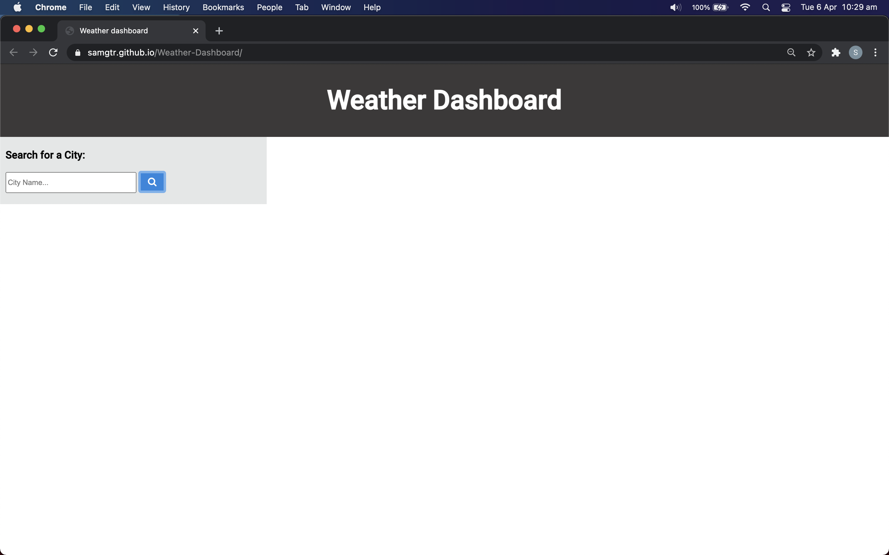
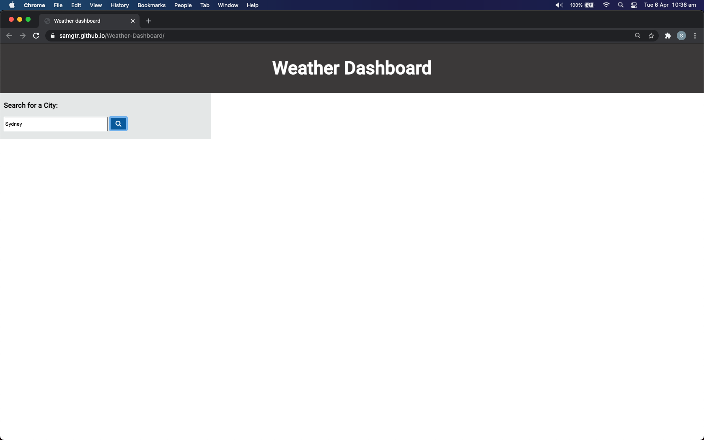
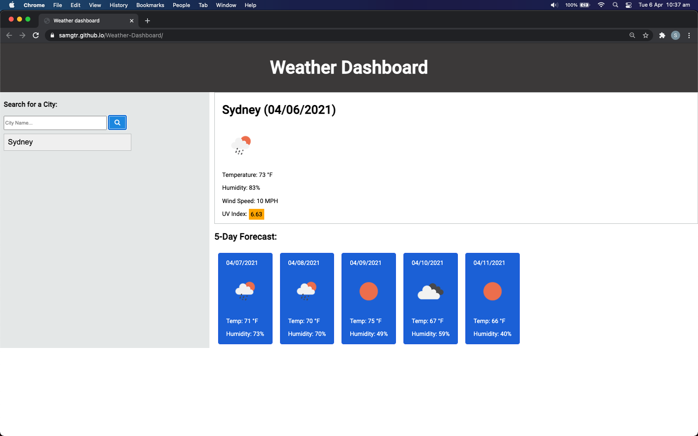
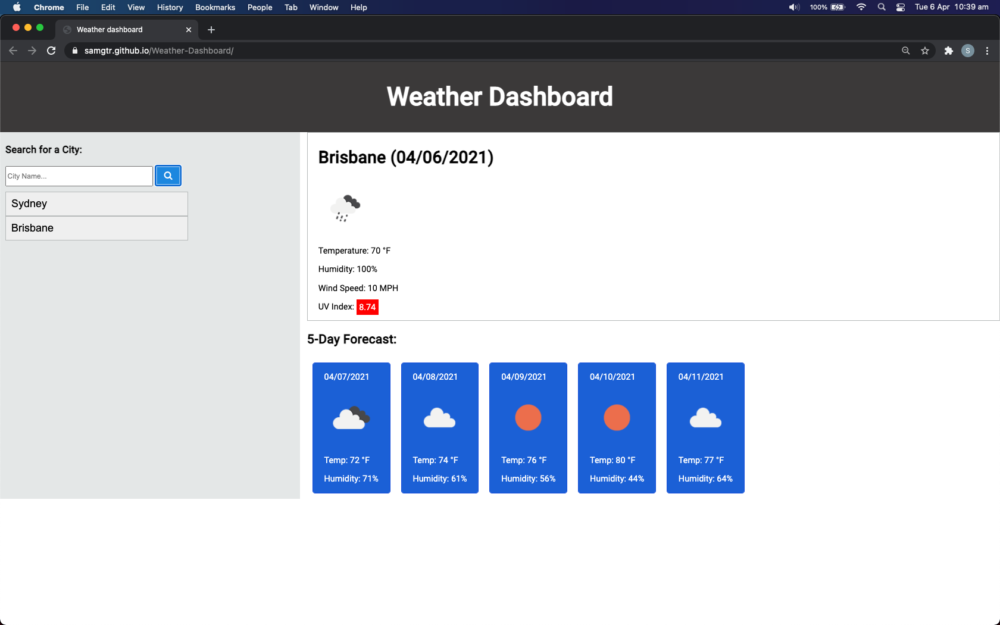

# Weather-Dashboard

This web application is developed as a Week-6 Homework requirement.
This is a Weather-Dashboard application designed using Javascript. On running the application, the user is presented with a search button for searching the current weather and five day forecast for a city. The user can enter the city name in the search area and then need to click the search button. Once city name entered and search button clicked, the application displays the weather for that city.

## Installation

- Git clone the application from : https://github.com/SamGTR/Weather-Dashboard.git
- Navigate to the index.html.
- Open the index.html file with any web browser.

## Description

This application is developed using HTML, CSS and Javascript files. The features of the application are as below:

- On running the application, user is presented with a browser layout showing the wetaher dashboard heading and search area with a button.

<kbd> </kbd>

- Then the user need to enter the city name in search area and click the search button.

<kbd> </kbd>

- When the user enters city name and click the search button, the current weather and five day forecast is displayed. Further, the city name is also added and displayed as search history.

<kbd> </kbd>

- When the user enters another city name and click the search button, the current weather and five day forecast for that new search is displayed. Further, the city name is added and displayed as search history below the first city searched.

<kbd> </kbd>

- If the user wants to see the weather of one of the city recently searched, then she/he can directly click on that city name in search history and the weather data would be displayed.

<kbd> </kbd>

## Technology

The web application is developed using HTML, CSS and Javascript files. 
- The HTML file links google fonts, moment.js and jQuery for functionality of the application.
- The CSS file contains styling elements of the application.
- Some of the HTML and CSS elements are devloped dynamically using Javascript.
- The Javascript file uses Moment() for current time and unix time calculations. For clarity purpose, two separate java files are created: script.js and click.js. Script.js is used for searching through the search button. Click.js file is used when searching from the search history.Also, the java files uses event listener and if/else statements for logic development. The js files also uses local storage for storing city name data.
- The application supports responsive layout for various screen sizes using media query in css file.

## Links

Following is the link to the Weather-Dashboard application:  
https://samgtr.github.io/Weather-Dashboard/

Following is the link to the Github repository for Weather-Dashboard application:  
https://github.com/SamGTR/Weather-Dashboard

## License

MIT
